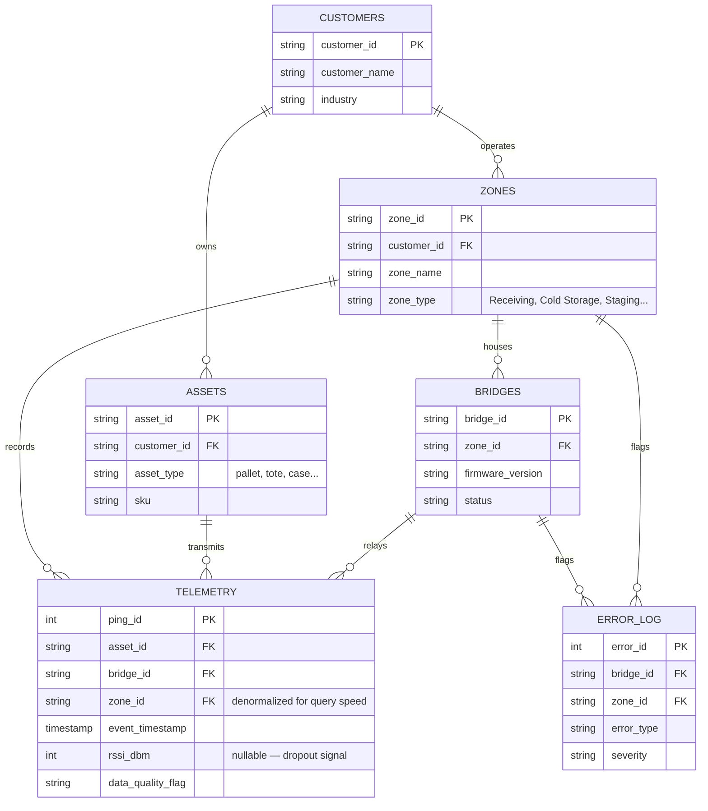

# Ambient IoT Deployment Analysis

**A practice investigation into a simulated ambient IoT warehouse deployment with six data-quality incidents, one live dashboard, and the reasoning behind each finding.**

> **A note on the data:** this project's structure Pixels, bridges, energy-harvested and telemetry is deliberately modeled on [Wiliot](https://www.wiliot.com)'s publicly described ambient IoT platform. I built it while preparing to interview for a Data Solutions Analyst role there, to get hands-on with the kind of data before I ever saw it for real. **Every row in this dataset is synthetically generated by the script in this repo.** No proprietary Wiliot data, systems, or confidential information was used or accessed at any point.

[→ View the live dashboard](https://github.com/user-attachments/files/30981983/wiliot.html)
<!DOCTYPE html>
<html lang="en">
<head>
<meta charset="UTF-8">
<meta name="viewport" content="width=device-width, initial-scale=1.0">
<title>Ambient IoT Deployment Health — Meridian Foods</title>
<link rel="preconnect" href="https://fonts.googleapis.com">
<link href="https://fonts.googleapis.com/css2?family=Space+Grotesk:wght@500;600;700&family=Inter:wght@400;500;600;700&family=JetBrains+Mono:wght@400;500;600;700&display=swap" rel="stylesheet">

</head>
<body>

  <header>
    

      

      

        <h1>Ambient IoT Deployment Health</h1>
        
Meridian Foods Distribution &middot; Cold Chain Facility (FAC01)

      

    

    

      JUN 1&ndash;14, 2026
      &#9888; Synthetic practice data
    

  </header>

  

    

      
95.4%

      
Pings with no data quality issue

    

    

      
6

      
Distinct incidents identified &amp; logged

    

    

      
11

      
Active bridges across 5 zones

    

    

      
3

      
Assets flagged for operational delay

    

  

  

    

      

        
Zone Health &mdash; click to filter

        clear filter &times;
      

      

    

    

      

        
Incident Feed &mdash; click to expand

      

      

      

    

  

  

    

      
BR003 &mdash; Distinct Assets per Hour, June 6

      
Collective anomaly: 3-hr hardware blockage, 02:00&ndash;05:00

      

    

    

      
BR004 &mdash; Daily Average RSSI

      
Signal degradation: -64.0 &rarr; -89.9 dBm over 14 days

      

    

  

  

    
Bridge Health Scorecard &mdash; click column to sort

    

      

        <svg width="13" height="13" viewBox="0 0 24 24" fill="none" stroke="currentColor" stroke-width="2"><circle cx="11" cy="11" r="8"/><line x1="21" y1="21" x2="16.65" y2="16.65"/></svg>
        <input type="text" id="bridgeSearch" placeholder="Search bridge or zone...">
      

      

        Problem bridges only (&gt;2% issues)
        

      

    

    

    <table id="scorecardTable">
      <thead>
        <tr>
          <th data-key="bridge_id">Bridge &#8597;</th>
          <th data-key="zone_name">Zone &#8597;</th>
          <th data-key="total_pings">Total Pings &#8597;</th>
          <th data-key="pct_issues">% Quality Issues &#8597;</th>
          <th data-key="avg_rssi">Avg RSSI &#8597;</th>
          <th data-key="avg_lag">Avg Ingestion Lag &#8597;</th>
        </tr>
      </thead>
      <tbody id="scorecardBody"></tbody>
    </table>
    

  

  

    

      
Duplicate Burst &mdash; BR005, June 10 14:32:00

      
Point anomaly: ingestion retry storm, 8.4x duplication

      

    

    

      
Dwell Time in Staging Area (Z03)

      
3 assets flagged &gt;2x zone average &mdash; confirmed operational, not sensor fault

      

    

  

  

    
About this dashboard

    
This is a <strong>self-directed practice project</strong>, not a Wiliot work product. I generated a synthetic 14-day IoT telemetry dataset (~20K pings across 5 zones, 11 bridges, 45 tagged assets) with deliberately injected data-quality issues &mdash; a hardware blockage, a duplicate-ingestion burst, signal degradation, network dropouts, a firmware mismatch, and an operational delay &mdash; then wrote the queries to detect each one and built this dashboard to visualize the findings.

    
My goal was to get hands-on with the kind of data quality monitoring, root-cause analysis, and stakeholder reporting this role involves before day one. Happy to walk through the queries, the generator script, or the reasoning behind any of these findings.

  

  <footer>
    Prepared as interview preparation &middot; not affiliated with or representing real Wiliot customer data
    Data generated Jun 2026 &middot; Dashboard v1
  </footer>

</body>
</html>

---

## Table of Contents

- [The Setup](#the-setup)
- [The Data Model](#the-data-model)
- [Six Things I Broke on Purpose](#six-things-i-broke-on-purpose)
- [Business Questions This Was Built to Answer](#business-questions-this-was-built-to-answer)
- [The Dashboard](#the-dashboard)
- [Stack & Running It Yourself](#stack--running-it-yourself)

---

## The Setup

Ambient IoT is battery-free sensors that harvest energy from ambient radio waves, sounds simple in a product pitch and gets complicated fast in practice. A "Pixel" attached to a pallet doesn't always report on schedule. Bridges lose power. Networks drop packets. Ingestion pipelines occasionally retry and double-send. None of that is a flaw in the pitch, it's just what real-world sensor data looks like, and it's exactly the kind of mess a Data Solutions Analyst gets handed.

So I simulated one: a 14-day deployment at a fictional cold-chain distribution facility, **Meridian Foods Distribution** with 5 warehouse zones, 11 bridges, 45 tagged assets, and roughly 20,000 raw telemetry pings. Then I deliberately broke six things about it, the way real deployments actually break, and built the analysis and dashboard to find them.

## The Data Model

Everything rolls up from raw pings to business-facing zones through this structure:

**The one rule that matters most:** `TELEMETRY` is grain **one row = one ping** — not one row per asset, not one row per hour. An asset pinging every 45 minutes for 14 days generates hundreds of rows under the same `asset_id`. Every mistake in this kind of dataset traces back to forgetting that — `COUNT(*)` and `COUNT(DISTINCT asset_id)` answer completely different questions, and mixing them up is the single most common way to produce a wrong number that *looks* right.

A few fields worth knowing before querying:

| Table | What one row represents | Watch out for |
|---|---|---|
| `dim_customers` | One deployment/account | Everything scopes to `customer_id` — in a multi-customer system, always filter first |
| `dim_zones` | One functional area of a facility | `zone_id` is denormalized directly onto `fact_telemetry` for convenience — technically derivable via `bridge_id`, but stored redundantly |
| `dim_bridges` | One physical gateway device | `firmware_version` matters — an outdated bridge can behave differently even on identical hardware (see Incident 6 below) |
| `dim_assets` | One tagged physical item (pallet, tote, case) | `sku` is static per asset in this dataset; a real reusable container's contents could change over its life |
| `fact_telemetry` | **One ping**, from one asset, via one bridge, at one instant | `rssi_dbm = NULL` means the *reading was lost*, not that signal was zero — an easy mistake to `COALESCE()` into a wrong average |
| `fact_error_log` | One system-detected incident that crossed a severity threshold | Not a raw log of every automated check — only things that got flagged |

*(Full column-by-column reference, including nullability and known quirks: [`DATA_DICTIONARY.md`](DATA_DICTIONARY.md))*

## Six Things I Broke on Purpose

Each of these is a real failure mode in sensor networks, injected deliberately, then found using the detection method described — no peeking at the generator script to "discover" them.

---

**1. Collective anomaly: hardware blockage**
`BR003`, Cold Storage A, went completely silent for 3 hours overnight. Zero pings, from any asset, on that bridge — while the second bridge in the same zone kept reporting normally the entire time.

*Detection:* hourly distinct-asset counts per bridge, checking for **sustained runs of zero**, not just a single quiet hour (a lone quiet hour is normal noise; three in a row isn't).
*Root cause:* signal resumed at full baseline strength the instant the window ended — no gradual recovery ramp — which rules out antenna decay and points to power loss or physical obstruction instead.

**2. Point anomaly: ingestion retry storm**
126 pings landed at the **exact same timestamp** on `BR005`, for only 15 distinct assets — an 8.4x duplication rate in a single instant.

*Detection:* `GROUP BY (timestamp, bridge)` and flag any group where `COUNT(*) > COUNT(DISTINCT asset_id)`.
*Why it matters more than it looks:* missing data fails loudly; duplicate data fails silently. Left un-deduplicated, this kind of spike quietly inflates every downstream count that touches it.

**3. Completeness issue: network dropout**
Background NULL rate across the whole deployment sits around 2%. On `BR008`, during one 5-hour window, it spiked to over 60%.

*Detection:* compare a bridge's NULL rate in a rolling window against its own trailing baseline — not a fleet-wide average, since normal traffic varies bridge to bridge.
*Root cause:* consistent with intermittent connectivity rather than a hardware fault — the pings that *did* arrive during the window were otherwise normal.

**4. Signal degradation: the slow one**
`BR004`'s average RSSI declined from a stable -64 dBm baseline to -89.9 dBm over 8 days — a 26 dB drop with no recovery. This is the one that's easy to miss if you're only looking at daily snapshots instead of the trend.

*Detection:* daily average RSSI per bridge, plotted as a trend line rather than a single current-state number.
*Root cause:* gradual and monotonic, not a sudden cliff — that shape specifically implicates something physical/environmental (antenna wear, a new obstruction) over a discrete hardware failure event.

**5. Throughput bottleneck**
`BR006`'s median ingestion lag (`ingestion_timestamp - event_timestamp`) jumped from ~5 seconds to 10–40 minutes during a 6-hour peak-load window.

*Detection:* this metric is invisible if you only look at `event_timestamp` — you need the gap between when a Pixel transmitted and when the cloud actually received it.
*Impact:* no data was lost, but anything depending on "live" dashboards during that window was stale without anyone necessarily noticing.

**6. Deployment anomaly: firmware mismatch**
A new bridge, `BR011`, was added to Cold Storage A mid-deployment running firmware `v2.9.4` against a fleet standard of `v3.2.1`.

*Detection:* this one doesn't show up in telemetry patterns at all, it only surfaces by cross-referencing `dim_bridges.firmware_version` against the fleet's mode. A good reminder that not every anomaly is visible in the fact table; some just require checking the dimension data nobody thought to look at.

---

## Business Questions This Was Built to Answer

The six incidents above are the *findings*. These are the *questions a Data Solutions Analyst actually gets asked* that this kind of analysis exists to answer — each with the underlying business goal, since the query is only half the job.

**"Is our data quality good enough for this customer to trust it?"**
Before anyone acts on this data, someone has to vouch for it. This is the first question in almost any deployment health check — a scale-of-the-problem gate, not a root-cause investigation yet.

**"Why isn't a specific tag reporting?"**
The single most common support ticket. The answer branches immediately: is the *asset* lost/stationary, or is the *sensor/network* the problem? Those get routed to completely different owners.

**"Calculate how many distinct assets each bridge interacts with over a rolling window, compared to its own historical baseline."**
The foundational anomaly-detection primitive everything else depends on. A bridge's "normal" traffic moves with staffing and seasonality — you can't use a fixed threshold, only a bridge compared against its own recent history.

**"Are there sustained periods where traffic falls below a threshold of the historical average?"**
The word *sustained* is doing the work here — a single quiet hour is noise, several in a row is a real incident. This is what should actually trigger a page, versus what belongs on a dashboard only.

**"Why are assets delayed in a warehouse zone?"**
Branches the same way as the tag question: is inventory genuinely stuck (an operations problem for the customer), or did a sensor miss a real zone-transition event (a data problem for us)? Checking ping *cadence* during the dwell period — steady vs. one large gap — tells you which.

*(Full question set — 11 total, each with the working SQL: [`BUSINESS_QUESTIONS.md`](BUSINESS_QUESTIONS.md))*

## The Dashboard

`index.html` is a single self-contained file — no external dependencies, no build step, every chart is hand-rolled inline SVG so it renders identically whether it's opened locally, viewed offline, or dropped behind a corporate firewall. It's also filterable, not just a static report:

- **Zone cards** cross-filter both the bridge scorecard and the incident feed together
- **Severity chips** narrow the incident feed to Critical / High / Medium
- **Search** filters the bridge scorecard by ID or zone, live
- **A "problem bridges only" toggle** hides anything under a quality-issue threshold — a rough sketch of an actual triage workflow: narrowing from "what's wrong across the whole facility" to "what do I actually need to act on"

---

*Built as interview preparation. Not affiliated with, endorsed by, or built using any proprietary data or systems from Wiliot or any other company — see the note at the top for exactly what "modeled on" means here.*
